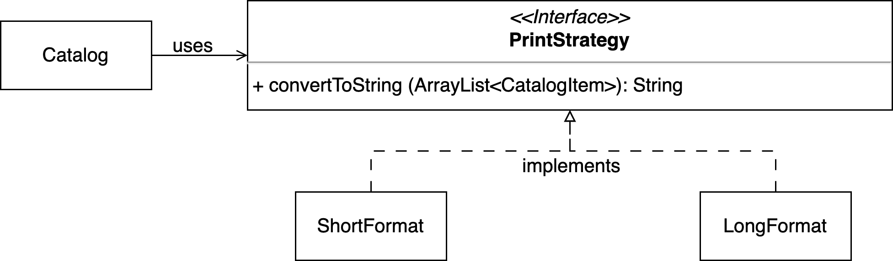

# Strategy for output details

## Objectives

1. Practice defining and implementing a Java interface
1. Practice using interfaces to achieve polymorphism

## Project Description

In this problem, you are given working code. You will need to redesign it using the strategy design pattern.

### Overview of the code in this directory

This directory contains a simple design for managing a library catalog. The Catalog class contains a collection of LibraryItems, and each LibraryItem has a unique ID, availability (true - available, false - unavailable), and a Book object. You can add new books to the catalog and search it by a keyword. You can also print the entire catalog collection, because Catalog class has a toString method.

The toString method of the Catalog class prints the collection in a short format: for each library item it prints the item id and the book title.

### Redesign instructions

We want to support a flexible printing format for the catalog. Redesign the existing code using the strategy design pattern such that the printing format could specified dynamically. The UML class diagram of the redesign is shown below.

There are two formats mentioned in the diagram. The short format is the current format Catalog uses. In the long format, we want to she the library item's id and the all the details of the Book (you can get all of book's details by calling the toString() method on a Book object).

Modify the Driver such that it accepts an additional command line argument specifying the book format: S - short format, L - long format. Your new driver will be run as:
java Driver S

or 

java Driver L

If neither S nor L is passed to the Driver, the driver should print out the usage instructions and terminate immediatelly. 
